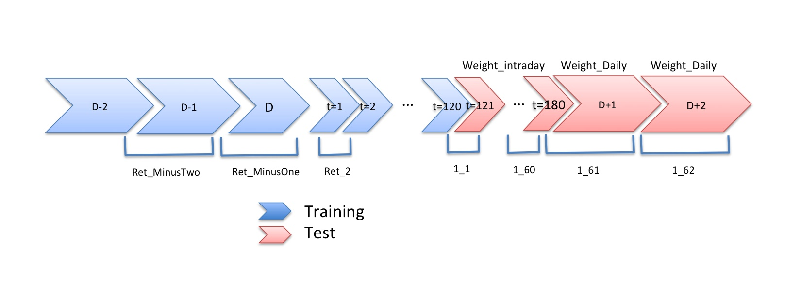

# The-Winton-Stock-Market-Challenge

### Abstract
This is a sample solution for solving the Winton stock market challenge. I implemented a simple LSTM network to solve this problem. You can see the competetion page from here:
[https://www.kaggle.com/c/the-winton-stock-market-challenge/data](https://www.kaggle.com/c/the-winton-stock-market-challenge/data)

In this competition the challenge is to predict the return of a stock, given the history of the past few days. 

We provide 5-day windows of time, days D-2, D-1, D, D+1, and D+2. You are given returns in days D-2, D-1, and part of day D, and you are asked to predict the returns in the rest of day D, and in days D+1 and D+2.

During day D, there is intraday return data, which are the returns at different points in the day. We provide 180 minutes of data, from t=1 to t=180. In the training set you are given the full 180 minutes, in the test set just the first 120 minutes are provided.

For each 5-day window, we also provide 25 features, Feature_1 to Feature_25. These may or may not be useful in your prediction.

Each row in the dataset is an arbitrary stock at an arbitrary 5 day time window.

How these returns are calculated is defined by Winton, and will not to be revealed to you in this competition. The data set is designed to be representative of real data and so should bring about a number of challenges.

### File descriptions
* __train.csv__ - The training set, including the columns of:
    * Feature_1 - Feature_25
    * Ret_MinusTwo, Ret_MinusOne
    * Ret_2 - Ret_120
    * Ret_121 - Ret_180: target variables
    * Ret_PlusOne, Ret_PlusTwo: target variables
    * Weight_Intraday, Weight_Daily

* __test.csv__ - The test set, including the columns of:
    * Feature_1 - Feature_25
    * Ret_MinusTwo, Ret_MinusOne
    * Ret_2 - Ret_120
* __sample_submission.csv__ - a sample submission file in the correct format

### Data fields
* __Feature_1 to Feature_25:__ Different features relevant to prediction
* __Ret_MinusTwo:__  This is the return from the close of trading on day D-2 to the close of trading on day D-1 (i.e. 1 day)
* __Ret_MinusOne:__ This is the return from the close of trading on day D-1 to the point at which the intraday returns start on day D (approximately 1/2 day)
* __Ret_2 to Ret_120:__ These are returns over approximately one minute on day D. Ret_2 is the return between t=1 and t=2. 
* __Ret_121 to Ret_180:__ Intraday returns over approximately one minute on day D. These are the target variables you need to predict as {id}_{1-60}. 
* __Ret_PlusOne:__ This is the return from the time Ret_180 is measured on day D to the close of trading on day D+1. (approximately 1
day). This is a target variable you need to predict as {id}_61. 
* __Ret_PlusTwo:__ This is the return from the close of trading on day D+1 to the close of trading on day D+2 (i.e. 1 day) This is a target variable you need to predict as {id}_62. 
* __Weight_Intraday:__ Weight used to evaluate intraday return predictions Ret 121 to 180
* __Weight_Daily:__ Weight used to evaluate daily return predictions (Ret_PlusOne and Ret_PlusTwo).

### How to use?

#### To use this work on your researches or projects you need:
* Python 3.7.0
* Python packages:
	* numpy
	* pandas
	* scikit-learn
	* keras
	* matplotlib

##

#### To install Python:
_First, check if you already have it installed or not_.
~~~~
python3 --version
~~~~
_If you don't have python 3 in your computer you can use the code below_:
~~~~
sudo apt-get update
sudo apt-get install python3
~~~~
##

#### To install packages via pip install:
~~~~
sudo pip3 install numpy scikit_fuzzy pandas scikit_learn
~~~~
_If you haven't installed pip, you can use the codes below in your terminal_:
~~~~
sudo apt-get update
sudo apt install python3-pip
~~~~
_You should check and update your pip_:
~~~~
pip3 install --upgrade pip
~~~~
##
